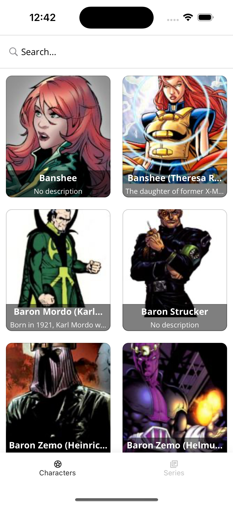

# Marvelous

This is a NativeScript + Angular app, showcasing Marvel Comics APIs. You can use the app to navigate between characters, series, comics, stories, events and creators.
All data is provided and owned by Marvel, with all rights reserved.

Also note that the Marvel Comics API comes with it's own [terms of use](https://developer.marvel.com/terms).



The main purpose of the app is for beginners to get insight into a slightly more complex app than the regular "hello world" type of app.

This app features
* Nested routing
  * page-router-outlet -> tab view -> router-outlet per tab
* Lazy loaded modules
* Encapsulated, re-usable routing
* Custom fonts
  * OpenSans for text
  * Material Icons for icons
* Generated API code from Swagger/OpenAPI spec
* Custom HTTP interceptor for setting API-key and tracing network requests
* Theme with Dark mode support
* ...and more

## Getting started

* Clone this repo
* Create a `.env` file for API secrets
* Install [NativeScript](https://docs.nativescript.org/)
* Create a [Marvel](https://developer.marvel.com/) account
  * [Get a key](https://developer.marvel.com/account)
  * Configure "Your authorized referrers"
  * Put the API key and referer into `.env`-file

```
MARVEL_API_KEY=<your_key>
MARVEL_API_REFERER=<your_referer>
```

Run application with `ns run ios|android --emulator`

## Contribute

I'm sure there are already many improvement areas here, and not much thought has gone into theming/styling.
So, if you see anything you would like to change or fix, feel free to send a PR.
